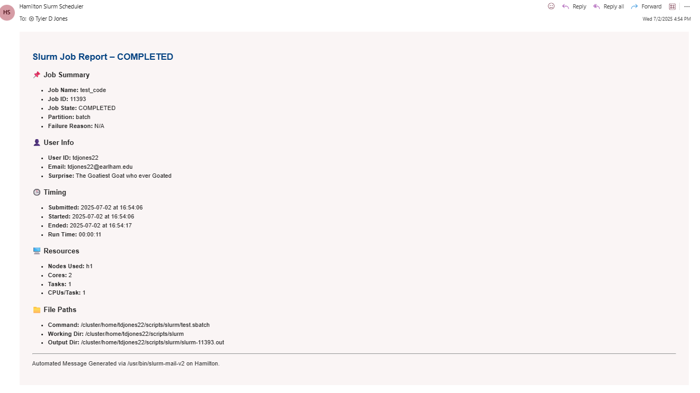

# Slurm-Mail-v2
The second iteration of the Slurm Mail script, this time written in Python. The biggest upgrade between this version and the old version is slightly more information that is presented in an easier-to-read format. 

## Example Email

